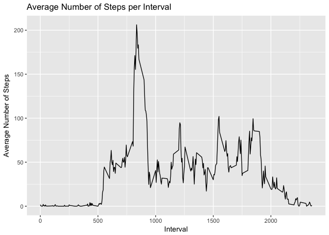
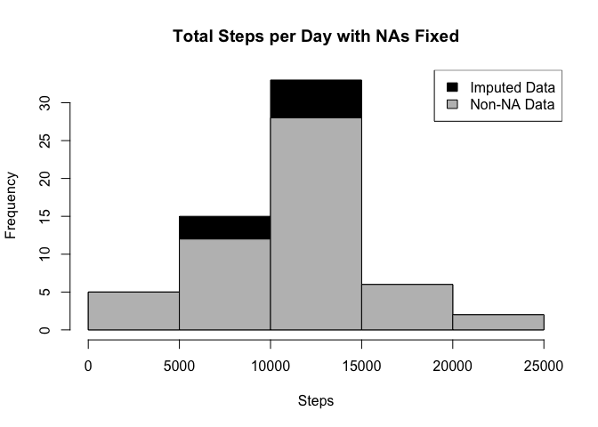
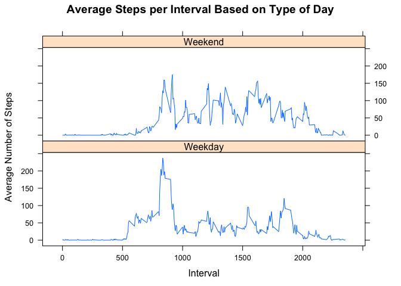

# Reproducible Research: Peer Assessment 1
Timothy Brennan  
3/27/2017  

## Data
The data for this assignment was downloaded from the course web
site:

* Dataset: [Activity monitoring data](https://d396qusza40orc.cloudfront.net/repdata%2Fdata%2Factivity.zip) [52K]

## Loading and preprocessing the data

Download, unzip and load data into data frame `data`. 

```r
if(!file.exists("getdata-projectfiles-UCI HAR Dataset.zip")) {
        temp <- tempfile()
        download.file("http://d396qusza40orc.cloudfront.net/repdata%2Fdata%2Factivity.zip",temp)
        unzip(temp)
        unlink(temp)
}

data <- read.csv("activity.csv")
```


## What is mean total number of steps taken per day?

Sum steps by day, create Histogram, and calculate mean and median.


```r
## summarizing total steps per date
sumTable <- aggregate(data$steps ~ data$date, FUN=sum, )
colnames(sumTable)<- c("Date", "Steps")

step_mean <- as.integer(mean(sumTable$Steps))
step_median <- as.integer(median(sumTable$Steps))
```

The `mean` is 10766 and the `median` is 10765.

## What is the average daily activity pattern?

* Calculate average steps for each interval for all days. 
* Plot the Average Number Steps per Day by Interval. 
* Find interval with most average steps. 


```r
##create average number of steps per interval
intervalTable <- ddply(cleanData, .(interval), summarize, Avg = mean(steps))

##Create line plot of average number of steps per interval
p <- ggplot(intervalTable, aes(x=interval, y=Avg), xlab = "Interval", ylab="Average Number of Steps")
p + geom_line()+xlab("Interval")+ylab("Average Number of Steps")+ggtitle("Average Number of Steps per Interval")
```

<!-- -->

```r
##Maximum steps by interval
maxSteps <- max(intervalTable$Avg)
##Which interval contains the maximum average number of steps
maxInterval=intervalTable[intervalTable$Avg==maxSteps,1]
```

The 5-minute interval, on average across all the days in the data set, containing the maximum number of steps is 835.

## Imputing missing values

Calculate and report the total number of missing values in the dataset (i.e. the total number of rows with NAs)


```r
sum(is.na(data$steps))
```

```
## [1] 2304
```

Devise a strategy for filling NA values.  I will substitute the missing steps with the average 5-minute interval based on the day of the week.


```r
## Create the average number of steps per weekday and interval
avgStepsTable <- ddply(cleanData, .(interval, day), summarize, Avg = mean(steps))

## Create dataset with all NAs for substitution
nadata<- data[is.na(data$steps),]
## Merge NA data with average weekday interval for substitution
data.filled<-merge(nadata, avgStepsTable, by=c("interval", "day"))
```

Create a new data set with NA values filled.


```r
## Reorder the new substituded data in the same format as clean data set
data.filled2<- data.filled[,c(6,4,1,2,5)]
colnames(data.filled2)<- c("steps", "date", "interval", "day", "DateTime")

##Merge the NA averages and non NA data together
mergeData <- rbind(cleanData, data.filled2)
```

Analyze filled data & plot histogram


```r
data.summary <- aggregate(mergeData$steps ~ mergeData$date, FUN=sum, )
colnames(data.summary)<- c("Date", "Steps")
```

Calculate the imputed mean and median


```r
## Mean of Steps with NA data taken care of
step_mean_filled = as.integer(mean(data.summary$Steps))

## Median of Steps with NA data taken care of
step_median_filled = as.integer(median(data.summary$Steps))
```

Calculate difference between imputed and non-imputed data.


```r
mean_diff <- step_mean_filled - step_mean
med_diff <- step_median_filled - step_median
```

Plot histogram


```r
## Creating the histogram of total steps per day, categorized by data set to show impact
hist(data.summary$Steps, breaks=5, xlab="Steps", main = "Total Steps per Day with NAs Fixed", col="Black")
hist(sumTable$Steps, breaks=5, xlab="Steps", main = "Total Steps per Day with NAs Fixed", col="Grey", add=T)
legend("topright", c("Imputed Data", "Non-NA Data"), fill=c("black", "grey") )
```

<!-- -->


* The imputed data mean is 10821
* The imputed data median is 11015
* The difference between the non-imputed mean and imputed mean is 55
* The difference between the non-imputed median and imputed median is 250

## Are there differences in activity patterns between weekdays and weekends?

Create a plot to compare steps on during weekdays vs weekends.  


```r
mergeData$DayCategory <- ifelse(mergeData$day %in% c("Saturday", "Sunday"), "Weekend", "Weekday")

library(lattice)

## Summarize data by interval and type of day
intervalTable2 <- ddply(mergeData, .(interval, DayCategory), summarize, Avg = mean(steps))

##Plot data in a panel plot
xyplot(Avg~interval|DayCategory, data=intervalTable2, type="l",  layout = c(1,2),
       main="Average Steps per Interval Based on Type of Day", 
       ylab="Average Number of Steps", xlab="Interval")
```

<!-- -->

On weekdays, there is a higher peak earlier in the day (getting ready and going to work?).  Overall there is more activity on the weekends (not sitting at a desk most of the day?).
